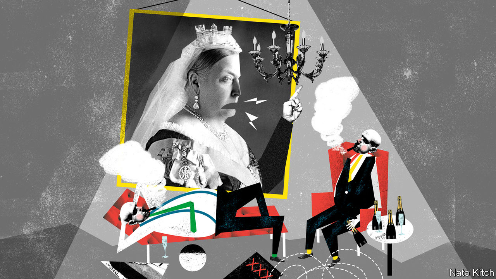

###### Bagehot

# Gertrude Himmelfarb and the politics of virtue 

##### The great historian of Victorian Britain had a message for today’s elite 

 

> Jan 11th 2020 

THE LAST of the great Victorian intellectuals died on December 30th. Gertrude Himmelfarb wasn’t a Victorian in the literal sense, either chronologically or geographically: she was born in Brooklyn, in 1922, the daughter of Jewish immigrants from Russia, and lived most of her life in Manhattan or Washington,  

DC. She was nevertheless a Victorian in spirit: she devoted her career to studying Victorian intellectuals—her favourite was Walter Bagehot—and shared that era’s stern moral values. She was also a master of a very Victorian art form: the highbrow essay designed not for an academic clique but for the educated public. 

Every great historian has a nagging obsession. Ms Himmelfarb’s was what she called “the paradox of liberalism”—the idea that a preoccupation with individualism undermines the economic and social foundations which make that preoccupation possible. She feared that what George Eliot described as “taking the world as an udder to feed our supreme selves” would end up dissolving social bonds and depleting cultural capital. This obsession led her to write, among many other works, a two-volume study of the Victorian idea of poverty. Her central conclusion was that the much-derided Victorians possessed a distinctive moral imagination: they cared enough about the poor to try to reform their conduct as well as to alleviate their immediate suffering. 

Ms Himmelfarb’s essay “From Clapham to Bloomsbury: A Genealogy of Morals” illustrates her enthusiasm for turning conventional wisdom on its head. The Clapham sect were a group of evangelical Christians widely mocked as hypocritical prigs. Ms Himmelfarb shows that they were leading campaigners for the abolition of slavery and prison reform. The Bloomsbury Group of writers and intellectuals, some of whom were descended from Clapham’s “saints”, are icons to the liberal intelligentsia. Ms Himmelfarb argues that they were self-indulgent rentiers who did little to make the world a better place. 

Ms Himmelfarb brought a rare passion to this argument for both historical and political reasons. She thought that the Victorians’ achievement had been undervalued: they forged not just the Industrial Revolution but also a moral reformation that cut the crime rate by half between 1850 and 1900. She also worried that, in embracing the Bloomsburyish values of the 1960s, America was dooming itself to follow Britain down the primrose path. 

Ms Himmelfarb was part of an intensely political family: her husband, Irving Kristol, was the godfather of neoconservatism, and her son Bill was a leading Republican intellectual who has morphed into an obsessive critic of Donald Trump. Her enthusiasm for drawing moral lessons from the Victorians gained her influence in Britain as well as in the United States. Margaret Thatcher and John Major echoed her arguments in her call for a revival of “Victorian values” and “back to basics”, respectively. Iain Duncan Smith’s troubled attempt to rewrite the rules of welfare to make sure that people are never better off claiming benefits than working bears her stamp. 

The doyenne of neoconservatism even found fans in the Labour Party. Gordon Brown, a former prime minister, was so impressed by her celebration of self-help and personal responsibility that he wrote an introduction to the British edition of her book “The Roads to Modernity: the British, French and American Enlightenments”. Frank Field, an influential Labour  

MP, has been influenced by her work in his long campaign to remind his party that welfare claimants are not just statistics but also moral agents who make personal choices. 

There was, inevitably, much criticism of a thinker so out of kilter with modern mores. Fellow historians have faulted her for understating Victorian hypocrisy. Left-wingers, who complained that her ideas blamed the victims rather than the system, dissuaded Mr Brown from holding a launch party for “Roads to Modernity” in Downing Street. They had a point: although there is clearly a distinction between someone who loses their job because their industry is shrinking and someone who gets sacked for drunkenness, Ms Himmelfarb paid far too little attention to the role of the destruction of stable manufacturing jobs in her analysis of the “demoralisation of society”. Pragmatists warned against the dangers of preachiness, and were vindicated in the short-term: both Mrs Thatcher and Sir John were battered by charges of hypocrisy when cabinet ministers were caught with their trousers down and Sir John’s affair with another cabinet minister was exposed. 

Boris Johnson, who has sired illegitimate children with the enthusiasm of an 18th-century squire, is unlikely to start extolling Victorian values. Yet for all its perils moralism is becoming a political force again. Just as the Victorians turned against pure laissez-faire liberalism in the mid-19th century, so there is a backlash against neo-liberalism and libertarianism. Both “blue” Labour and “red” Tory thinkers talk about rebuilding communities. The #MeToo movement has exposed the seamy underbelly of the sexual revolution. Millennials are more restrained than baby-boomers when it comes to sex, drugs and drinking. Conservative thinkers have started to talk of a revival of the “civic capitalism” exemplified by Quaker families such as the Cadburys. 

The Victorians’ greatest reform was not of the poor but of the rich. At the start of Victoria’s reign, the rich were a notably degenerate lot. Office-holders treated the state as a source of sinecures. Stockholders in the East India Company got filthy rich by plundering India. Oxbridge colleges were nests of sybarites. A great generation of reformers changed all this. Civil-service jobs were opened to merit. Companies lost their monopolies. Oxbridge colleges were revitalised. The Victorian elite was successful because it applied the highest standards of moral probity and open competition to itself before it started preaching to the poor. Today’s elite, bloated after several decades of having things its own way, should do likewise. 

■