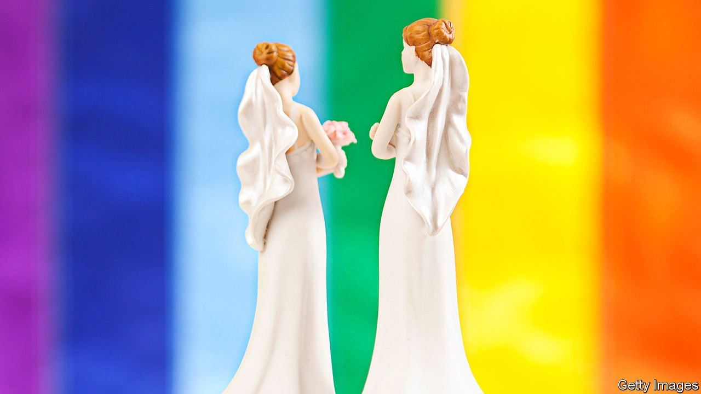

###### Pride before a fall

# Why lesbian couples are more likely to divorce than gay ones 

##### The trials of same-sex marriage 

 

> Jan 9th 2020 

SARAH ALWAYS wanted to get married. She grew up with “girly girly” dreams of a big ceremony. In 2016, two years after the law changed to allow single-sex marriages, she walked down the aisle, wearing the big white dress she had longed for. “The wedding was perfect,” she says. “It was a shame about the marriage.” 

She is one of a growing number of same-sex divorcees. By the end of 2018, 900 same-sex couples, of whom nearly three-quarters were female, had divorced. 

More lesbians than gay men get married, but the discrepancy in divorce rates is much wider than that in marriage rates. Gay men account for 44% of same-sex marriages in the latest data, but make up only 26% of divorcees. In any case, more men formed civil partnerships than women in the 14 years for which data are available, yet more women dissolved them. The same trend crops up in the Netherlands, the first country to allow same-sex marriage: in the ten years from 2005, 15% of gay marriages failed, compared with 30% of lesbian ones. 

Lisa Power, one of the co-founders of Stonewall, a gay-rights charity, reckons part of the explanation might be that lesbians move quicker from first dates to marriage than gay men, then repent at leisure. “We all used to move in with each other at the drop of a hat.” Comparisons with heterosexual divorces offer other possible explanations. Women in such marriages are far more likely than men to instigate divorce proceedings. They petitioned for nearly two-thirds of such divorces in the last ten years. Same-sex couples might reflect the same pattern, with two men less likely to contemplate divorce. Ayesha Vardag, president of Vardags, a firm of divorce lawyers, speculates that women are much less likely to tolerate marital infidelity than men. Dutch women cite infidelity as a reason for divorce more than men. 

Lesbians are also more likely to have been married before. About 18% of women who formed civil partnerships were divorcees, compared with 10% of men. Once age is accounted for, second marriages are more likely to fail than first marriages. 

Whatever the explanation, Ms Vardag is most struck by the similarities between her clients, gay or straight. “It’s distress about adultery or domestic violence, not being listened to, the sense of one party slogging away and the other one taking it easy,” she says. “All the same things crop up.”  

■