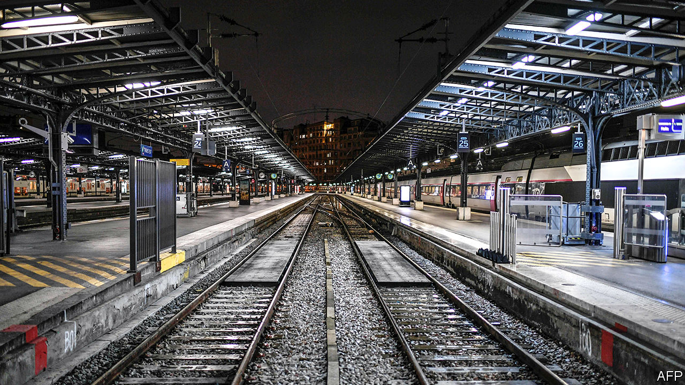
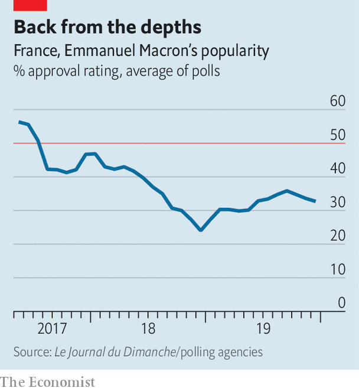

###### Month two

# Big protests in Paris are Emmanuel Macron’s severest test yet 

##### Putin couldn’t pass pension reform. Can France’s president do better? 

 

> Jan 9th 2020 

THE BOULEVARDS of the French capital were filled once again this week with banners and balloons, demonstrators, riot police and tear gas. A transport strike against pension reform, which began on December 5th and continued throughout the Christmas holidays, has now entered its second month. This week lawyers, teachers, hospital workers and others joined the protests. Railway workers have now been on strike for longer than during the protests of 1995, which forced a previous government, under Alain Juppé, to shelve its own pension reform. On one day in December, more people took to the streets than at any other time under Emmanuel Macron’s presidency. 

How and when this conflict ends matters not only to the commuters struggling daily to reach the capital from remote Paris suburbs. It will also be the measure by which to judge Mr Macron’s claim to be able, unlike his predecessors, to “transform” France. 

The French mandatory-pension system, made up of 42 different regimes, consumes 14% of  

GDP, nearly twice the  

OECD average. Once in their armchairs, the French receive, on average, 60% of pre-retirement earnings, compared with 49% in the  

OECD as a whole. Thanks to long life expectancy (now 80 for men, 86 for women), they then spend roughly a quarter of a century in retirement. Those on “special regimes” retire earlier even than the legal minimum age of 62. Train drivers can stop at 50, a legacy of coal-shovelling times. Because today’s pensions are paid by charges on today’s workers, the system needs constant tweaking. By 2025, according to the official pensions advisory council, the overall pensions deficit will be somewhere between €8bn and €17bn ($8.9bn-$19.7bn). 

With just two years left before the next presidential campaign, and having narrowly survived the  

 (yellow jackets) protests against costly fuel, Mr Macron might have chosen a mere technical fix. A 0.7-percentage-point increase in pension charges, for instance, would close the financing gap by 2025. But Mr Macron campaigned for the presidency in 2017 on a more radical promise. He vowed to reshape the labour, training and welfare systems so as to encourage job creation, adapt France for a “post-salary” era, ease mobility and protect people rather than jobs. 

 

To this end, Mr Macron vowed in his manifesto to merge the 42 regimes into a single points-based system, with the same rules for all. This will spell the end of the special regimes, which Mr Juppé did not dare to do 25 years ago, as well as even out calculation rules that favour public-sector workers. The plan, unveiled last month by Edouard Philippe, the prime minister and a former aide to Mr Juppé, will also introduce a minimum monthly pension of €1,000. Those earning over €120,000 a year will pay mandatory charges at a lower rate above that level, but these will only finance others’ pensions, not their own. The head of the employers’ federation, Geoffroy Roux de Bézieux, calls the new system “very redistributive”. 

This is not, however, the way the unions see it. The Confédération Générale du Travail ( 

CGT), with its history of  

 (class struggle), rejects out of hand the proposed new points-based system. It accuses Mr Macron, “a president of the ultra-rich”, of destroying the pension system. On strike from day one, the  

CGT refuses to go back to work until the government abandons its plans. This week its members invaded the Paris office of BlackRock, an American asset manager, insisting (wrongly) that the lower pension charges on high salaries are Mr Macron’s secret gift to private pension providers. 

Talks between unions and the government resumed on January 7th. Mr Macron says that he has no intention of shelving his reform. So no compromise will satisfy the  

CGT. Instead the government hopes to reach a deal with the more moderate Confédération Française Démocratique du Travail ( 

CFDT), now the country’s biggest union. Its leader, Laurent Berger, backs a points-based system. But he has taken part in the strikes because of the new “pivot age” of 64. Introduced by Mr Philippe last month, the idea is to build incentives around this age, to encourage the French to stay at work longer. 

Were the government to drop this, in order to split the unions, it would look like a concession too far. At some point, the French will have to accept the need to work longer, if they are not to leave younger generations with an intolerable financial burden. As it is, Mr Philippe has already given way spectacularly to demands from those on special regimes. He has promised dancers at the Paris Opera, whose regime dates back to 1698, that the points system will affect only new recruits. Prison wardens, air-traffic controllers, pilots, policemen and firefighters have all been promised exceptions. Even train drivers have been told that the rules will apply only to those born after 1985. Teachers, who are poorly paid in France, have been promised more money. 

It may be, however, the only basis for compromise with the  

CFDT. “Economically the pivot age doesn’t make sense,” says Ludovic Subran, chief economist at Allianz, an insurer. “Under a points-based system you leave it to individuals to decide when they have accrued enough to retire.” Much will depend on the momentum over the next week or so. A big turnout was expected for a one-day protest on January 9th. But overall participation in the strike by railway workers fell from 32% on December 6th to 6% on January 3rd, and among train drivers from 87% to 31%. Although most polls show people support the strikes, for the first time, one poll has shown the number falling below 50%. Yet most of the French are also still against the proposed new system. Poor communication, flourishing conspiracy theories and hostility to the perennially haughty Mr Macron mean that, even now, few believe his claim that he is trying to preserve France’s pension system rather than destroy it.  

■