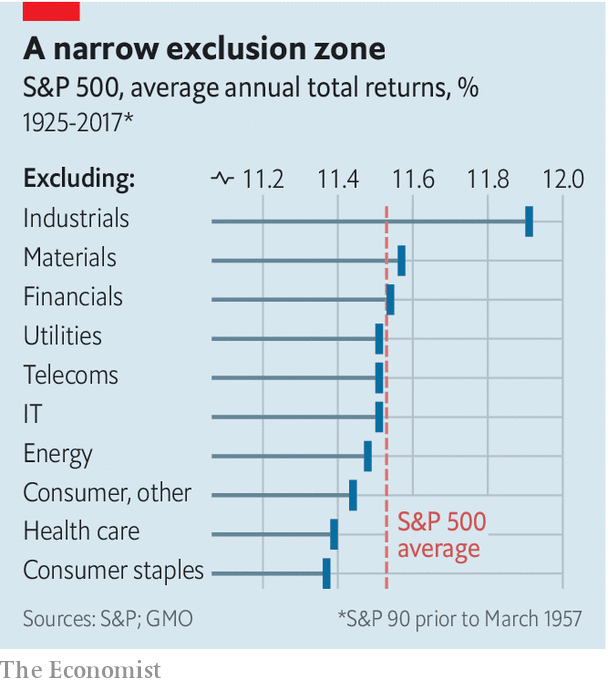

###### Buttonwood

# Jeremy Grantham on divesting from Big Oil 

##### A contrarian investor on the hazards of owning fossil-fuel stocks 

 

> Jan 9th 2020 

LATE LAST year Jeremy Grantham, an investor routinely described as “legendary”, spoke about  

ESG (environmental, social and governance) investing at a conference in London. His presentation was slick; his accent floated somewhere in the mid-Atlantic (Mr Grantham is English but has lived in America for ages). “I love  

S and  

G,” he began. “But  

E is about survival.” 

Three-letter abbreviations have been a constant in Mr Grantham’s professional life. He is the  

G in  

GMO, which stands for Grantham, Mayo and van Otterloo, the fund-management group he co-founded. His firm has a distinctive philosophy: it favours companies with low share prices relative to measures of fundamental worth, such as cash flows or the value of assets. Mr Grantham owes much of his public profile to his decrying of stockmarket bubbles. 

This sort of hard-headed, long-termist approach also informs Mr Grantham’s views on environmental policy. And his conclusion is that investors should avoid owning oil stocks. 

It is a call that raises hackles. Committees that set investment policies for pension funds fear that if they shun oil stocks it will be harder to reach their financial goals. Mr Grantham checked the data to find out whether, and how much, omitting the stocks of any industry over three decades would have hurt a hypothetical investor. He created synthetic portfolios that left out each of the ten broad stockmarket sectors and compared their returns with the market as a whole. 

The results were surprising: it made hardly any difference. The  

S&amp;P index returned an average of 9.71% annually between 1989 and 2017; the index excluding energy stocks returned 9.74%. The range of returns, from the worst portfolio to the best, was just 0.5 percentage points. 

 

This finding seemed like it might be a fluke. But a further check, going back to 1925, had a similar outcome. The spread between the best and worst portfolios was 0.54 percentage points; there was hardly any gap between the portfolio with energy stocks and without them (see chart). This is worth knowing, whatever your views on  

ESG. The market, it seems, has done rather a good job over time of pricing stocks so that no broad industry group yields abnormal returns. 

Mr Grantham believes that oil might yet prove an exception. Oil demand has already peaked in rich countries and, as climate fears grow and green technologies become cost-effective, it will eventually peak worldwide. But not everyone is keenly focused on this prospect. Scepticism regarding climate science is common in America. To the extent that sceptics are investors, and are betting on business as usual, at least some of the risks facing Big Oil may not be in the price. 

Investors might, for instance, miscalculate the speed of transition to greener energy. Advances in materials science and battery technology are making electric vehicles a cost-effective alternative to petrol-fuelled cars, Mr Grantham reckons. Other potential hazards face oil companies, including increased regulation and costly lawsuits. In other industries, such as tobacco, firms have been forced to pay up when found to have knowingly sold harmful products. He thinks the oil industry faces a similar reckoning. 

Is there also a moral case for disinvestment? An argument against is that oil firms are best placed to speed the transition to solar and wind power. They have experience of managing big projects in difficult terrain. And many would say that dumping oil stocks is a pointless salve to the eco-warrior’s conscience. Bill Gates, a software mogul and philanthropist, has argued that people should not waste idealism and energy on a policy that will not cause any reduction in the use of fossil fuels. What matters are incentives set by governments: tax breaks to fund research in green energy; tax rises to discourage carbon use. But this misses the point, says Mr Grantham: “You have to make the oil industry a pariah for bad behaviour.” Only then will politicians feel the need to act. 

A lot of finance types quietly suspect that greenery is anti-capitalism in metastatic form. Mr Grantham is clearly not of this anti-business persuasion. That makes it far harder to dismiss his arguments out of hand. “This is the first time that a major industry has been put on notice that it is going out of business, even if it may take a long time,” he says. His arguments pose a challenge to investors: do you really want to go along for such a bumpy ride? 

