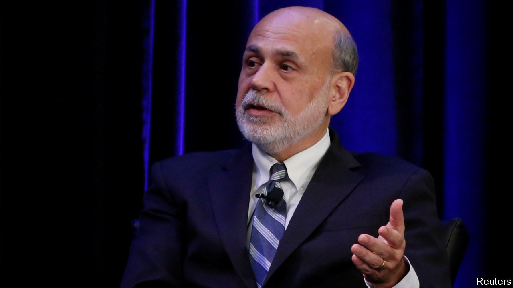

###### Missing: helicopter Ben

# Monetary policy will not be enough to fight the next recession 

##### Ben Bernanke, a former Fed chief, is complacent 

 

> Jan 9th 2020 

THE BIGGEST challenge economists face today is how to deal with downturns. America’s expansion is the longest on record; a slowdown at some point is inevitable. The fear is that central banks will not have enough tools to fight the next recession. During and after the financial crisis they responded with a mixture of conventional interest-rate cuts and, when these reached their limit, with experimental measures, such as bond-buying (“quantitative easing”, or  

QE) and making promises about future policy (“forward guidance”). The trouble is that today across the rich world short-term interest rates are still close to or below zero and cannot be cut much more, depriving central banks of their main lever if a recession strikes. 

Fear not, argues Ben Bernanke, who led the Federal Reserve through the crisis. In a speech on January 4th he said that the lesson of the past decade is that  

QE and forward guidance can provide substantial stimulus—equivalent, he calculates, to rate cuts of about three percentage points. That provides at least half the firepower the Fed has typically used to fight recessions. So long as interest-rate cuts can provide the other half—ie, if rates can still fall two to three percentage points—monetary policy will retain its potency. As a result, Mr Bernanke says, calls for a bolder overhaul of the toolkit “seem premature”. 

Mr Bernanke is right that  

QE and forward guidance have been effective economic stimulants, although judging their exact impact is tricky. But he is too sanguine, for three reasons. First, among the big economies only America looks remotely close to passing his firepower test. In the euro zone and Japan, safe ten-year debt yields a return of less than zero. That suggests short-term rates are unlikely to rise much in the 2020s. It also means that  

QE and forward guidance, which are supposed to work by lowering long-term interest rates, could run out of room—since they cannot fall much below zero. Other central bankers are sounding the alarm. This week Mark Carney, the outgoing head of the Bank of England, warned that the global economy faces a liquidity trap in which monetary policy loses its bite. 

Mr Bernanke acknowledged that Europe and Japan will need fiscal stimulus, rather than only monetary policy, to fight a downturn. But he also implied that all that might be needed is a one-off blast of spending or of tax cuts, after which central banks would be back in control. In fact in Japan decades of deficits have pushed public debt to nearly 250% of  

GDP without interest rates rising much. Instead of a one-off boost, the low-rate rich world needs fiscal policy to be more active over a long period. 

Second, even America, where interest rates are higher, passes Mr Bernanke’s health check only if you squint very hard. The short-term interest rate languishes at 1.5-1.75%, beneath his mooted zone of safety. Mr Bernanke draws comfort from the fact that economic models—and Fed policymakers—expect rates eventually to settle at a higher “natural” rate of interest. But investors are more pessimistic. America’s ten-year bond yield is only 1.8%. Even the 30-year yield is only around 2.3%. 

The models may be right (although those who estimate the natural rate warn that their work is “highly imprecise”). But a downturn could strike before rates have recovered to their natural level. Just look at Britain. One of the papers which Mr Bernanke cites suggests that Britain’s natural rate is fully 3.4%, more than four times the yield on its ten-year bonds. The Bank of England is far likelier to have to fight a recession in the 2020s than to raise interest rates that high. 

Third, and most important, interest rates have been in long-term decline. This fall is usually portrayed as having started in the 1980s. But new research suggests it is a much longer-run phenomenon, and that the period of high rates around that time was a historical peculiarity (see  

). Fed officials have spent years lowering their estimates of where rates will settle. Although it is not certain that such estimates will continue to fall, it would be brave to assume otherwise. The belief that rates will rise substantially has ruined many investors in recent years; in Japan a bet in that direction is nicknamed “the widow-maker”. 

Governments and central banks need to redesign their toolbox to deal with a low-rate world. This means finding ways to bridge the shrinking gap between monetary policy, which is set by technocrats, and fiscal policy, which is set by politicians. It could even require the careful use of a radical new tool like “helicopter money”—a handout to the public funded by the printing presses. In the past Mr Bernanke debated these bolder ideas, earning himself a nickname. Where is “helicopter Ben” when you need him?  

■