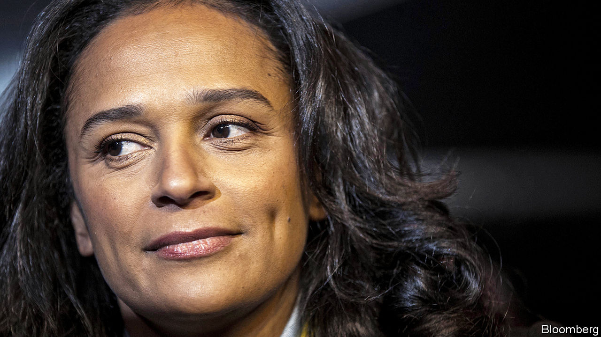

###### Her struggle

# A sticky patch for Isabel dos Santos, Angola’s princess 

##### The daughter of Angola’s former strongman wants her seized assets back 

 

> Jan 9th 2020 

ISABEL DOS SANTOS lives modestly these days. Or so the billionaire daughter of a former Angolan president, José Eduardo dos Santos, says. She arrived on foot to meet your correspondent at a smart hotel in London; and at the end of the interview she disappeared off towards a Tube station. It is a step down for a woman who once flew the rapper Nicki Minaj to Luanda, Angola’s capital, at a cost of millions. But these days Africa’s most prominent businesswoman has good reason to play it cool. 

On December 31st an Angolan court ordered that all of Ms dos Santos’s assets be frozen. They include her stakes in Unitel, Angola’s biggest mobile phone company, and Fomento de Angola, a bank, as well as myriad smaller enterprises such as a supermarket, a cinema and a mall. The seizure is not the only calamity to afflict the dos Santos clan of late. In December Isabel’s half-brother, José Filomeno, appeared in court over allegations that he transferred $500m out of Angola illegally. He claimed he could not afford a lawyer to defend himself. In October her half-sister, Welwitschia, was stripped of her parliamentary seat. 

The government of Angola says it is owed $1bn by Ms dos Santos and her business associates, and the seizure is a simple legal precaution. Ms dos Santos says that it is all a concerted effort to sully the good name of her father, who ran Angola for almost 40 years until 2017. She may have a point. When he handed over the presidency to João Lourenço, his defence minister, few expected Mr dos Santos to surrender actual power. But Mr Lourenço quickly set about defenestrating the dos Santos clan. “He decided early on to embark on a campaign to discredit President dos Santos,” says his daughter. 

Ms dos Santos claims she is an innocent victim of this vendetta. In fact, she maintains, her success in post-civil-war Angola has absolutely nothing to do with the fact that her father happened to be president. At length she explains how she founded Unitel in an office above a shop where she sold phones to market women. People “go to my supermarket because it has the best fish section in the country”, she says, not because of who her father is. 

Many of the accusations against Ms dos Santos relate to her time as chairwoman of Sonangol, Angola’s national oil company, between 2016 and 2017. Rafael Marques de Morais, an Angolan anti-corruption campaigner, says that she used the position to funnel money to herself. He points to a payment of $38m she authorised to a firm she owns in Dubai. Ms dos Santos says she took the job reluctantly and the $38m was payment for legitimate consulting services. In fact, she insists, working for Sonangol was a “big personal sacrifice...but I do think that it’s important to do right for your country.” 

Luanda is one of the most expensive cities on earth. The vast majority of Angolans live on less than a few dollars a day. Many would laugh at the idea that the woman known as “the princess” made any sacrifices for them. But Ms dos Santos, who has not set foot in Angola since 2018, insists that she is popular. Lots of Angolans “see me as a role model”, she says. 

One thing she is sadly right about is that little has improved since her father left office. The economy has been in recession for four years. And, although the dos Santos family is out, plenty of dodgy officials remain in their posts. “Mr Lourenço’s war on corruption is very selective,” she says. That much is hard to dispute. 

