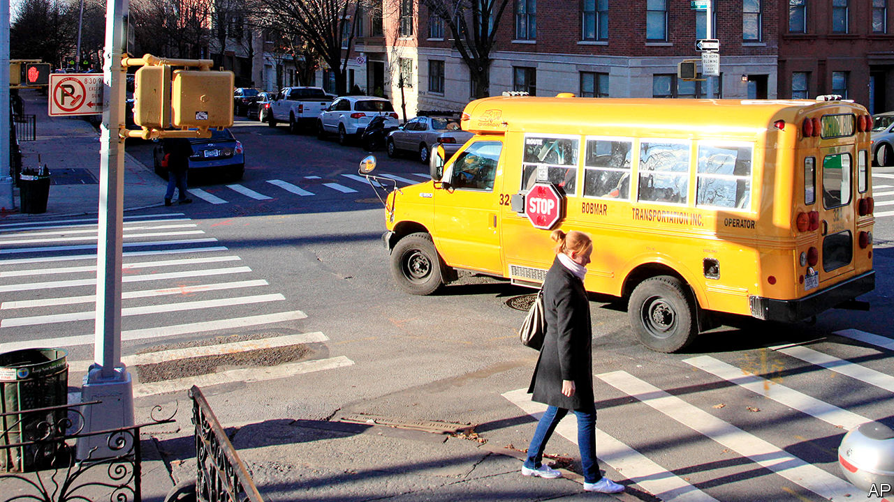

###### American education

# A Brooklyn school district tackles school segregation 

##### Early signs indicate the potential benefits of changing the admissions process 

 

> Jan 9th 2020 

NEW YORK CITY is famous for its diversity. Yet the 1.1m pupils in the city, who are mostly non-white, attend some of the most segregated schools in the country. They are even more segregated than schools in some southern cities such as Atlanta. Complacency has reigned for decades. But a school district in Brooklyn is showing early signs of success in a drive towards integration.  

District 15 encompasses expensive brownstone houses in Park Slope, immigrant enclaves in Sunset Park and one of the country’s largest public-housing projects in Red Hook. Despite that, it remained intensely segregated. The more affluent—and usually white—school-age children flocked to the district’s “good schools”. Last year, after a parents’ campaign, the district eliminated admission screens, which included test scores, attendance and behaviour records, for its 11 middle schools. Parents still rank their preferred schools, but now the district uses a lottery, with 52% of places at each school set aside for pupils who come from poor families, are still learning English or are homeless. 

Eight of the 11 schools are now hitting integration-rate targets. Richard Kahlenberg of the Century Foundation, a think-tank, calls it “one of the most exciting educational-reform efforts in the entire country”. One school, MS51, was 47% white last year. It is now 28% white.  

It is still early days for District 15. But so far, integration appears to be stable. Fears of “white flight” out of the public-school system have not been realised. The middle schools’ incoming classes remain 31% white, roughly the same since 2015. MS88, which was only 9% white last year, is now 24% white. Ailene Mitchell, MS88’s principal, says children from different backgrounds are starting to socialise with each other and joining each other’s after-school activity programmes. Jason Hoffner, a teacher, says some of the “new” pupils had near-perfect exam scores, but in classroom discussions there is little difference.  

The city hopes District 15’s success can be replicated. Poor children who go to integrated schools have higher test scores, are more likely to go to college and are less likely to drop out of school. 

It may be a tough sell. One teacher notes that parents in Park Slope can be competitively progressive. The same zeal does not exist across the city. Even in liberal Brooklyn, there was unease at first about District 15’s integration plan. A plan to desegregate the district’s elementary schools has been postponed a year to do more outreach. Sweeteners, such as dual-language immersion programmes or Montessori teaching approaches, may help. “We won’t have real integration until kids are going to each other’s birthday parties and bat mitzvahs,” says Anita Skop, the district superintendent. But “it’s coming”. 

