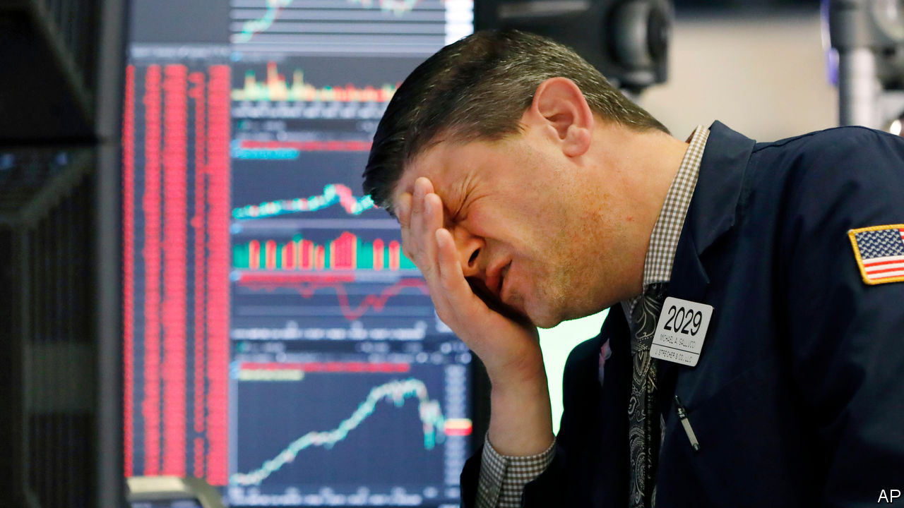
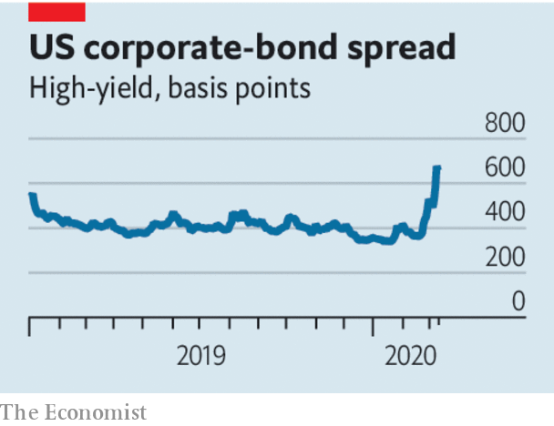

###### V is for vicious

# How to deal with a new sort of financial shock 

##### The subprime crisis is not a good guide to markets today 

 

> Mar 12th 2020 

 This article was updated after the European Central Bank’s policy meeting on March 12th.

WHEN FACED with a bewildering shock it is natural to turn to your own experience. As covid-19 rages, investors and officials are scrambling to make sense of the violent moves in financial markets over the past two weeks. For many the obvious reference is the crisis of 2007-09. There are indeed some similarities. Stockmarkets have plunged. The oil price has tumbled below $40 a barrel. There has been a flurry of emergency interest-rate cuts by the Federal Reserve and other central banks. Traders are on a war footing—with a rising number working from their kitchen tables. Still, the comparison with the last big crisis is misplaced. It also obscures two real financial dangers that the pandemic has inflamed. (For more coverage of covid-19 see our .)

The severity of the shock so far does not compare with 2007-09. Stockmarkets have fallen by a fifth from their peak, compared with a 59% drop in the mortgage crisis. The amount of toxic debt is limited and easy to identify. Some 15% of non-financial corporate bonds were issued by oil firms or others hit hard by the virus, such as airlines and hotels. The banking system, stuffed with capital, has yet to seize up; interbank lending rates are under control. When investors panic about the end of civilisation they rush into the dollar, the reserve currency. That has not yet happened (see ).

The nature of the shock is different, too. The 2007-09 crisis came from within the financial system, whereas the virus is primarily a health emergency. Markets are usually spooked when there is uncertainty about the outlook six or 12 months out, even when things seem calm at the time—think of asset prices dropping in early 2008, long before most subprime mortgage borrowers defaulted. Today, the time horizon is inverted: it is unclear what will happen in the next few weeks, but fairly certain that within six months the threat will have abated.

 

Instead of tottering Wall Street banks or defaults on Florida condos, two other risks loom. The first is a temporary cash crunch at a very broad range of companies around the world as quarantines force them to shut offices and factories. A crude “stress test” based on listed companies suggests that 10-15% of firms might face liquidity problems (see ). Corporate-bond markets, which demand precise contractual terms and regular payments, are not good at bridging this kind of short but precarious gap.

In 2007-09 the authorities funnelled cash to the financial system by injecting capital into banks, guaranteeing their liabilities and stimulating bond markets. This time the challenge is to get cash to companies. This is easy in China, where most banks are state-controlled and do as they are told. Credit there grew by 11% in February compared with the previous year. In the West, where banks are privately run, it will take enlightened managers, rule tweaks and jawboning from regulators to encourage lenders to show clients forbearance. Governments need to be creative about using tax breaks and other giveaways to get cash to hamstrung firms. While America dithered, Britain set a good example in this week’s budget (see ).

The second area to watch is the euro zone. It is barely growing, if at all. Central-bank interest rates are already below zero. Its banks are healthier than they were in 2008 but still weak compared with their American cousins. Judged by the cost of insuring against default, there are already jitters in Italy, the one big economy where banks’ funding costs have jumped. On March 12th the European Central Bank promised additional liquidity for the banking system, notably to support lending to small and medium-sized firms (but did not cut interest rates). The danger is that it, national governments and regulators fail to work together.

Every financial shock is different. In 1930 central banks let banks fail. In 2007 few people had heard of the subprime mortgages that were about to blow up. This financial shock does not yet belong in that company. But the  scare of 2020 does create financial risks that need to be treated—fast.■

Dig deeper:

