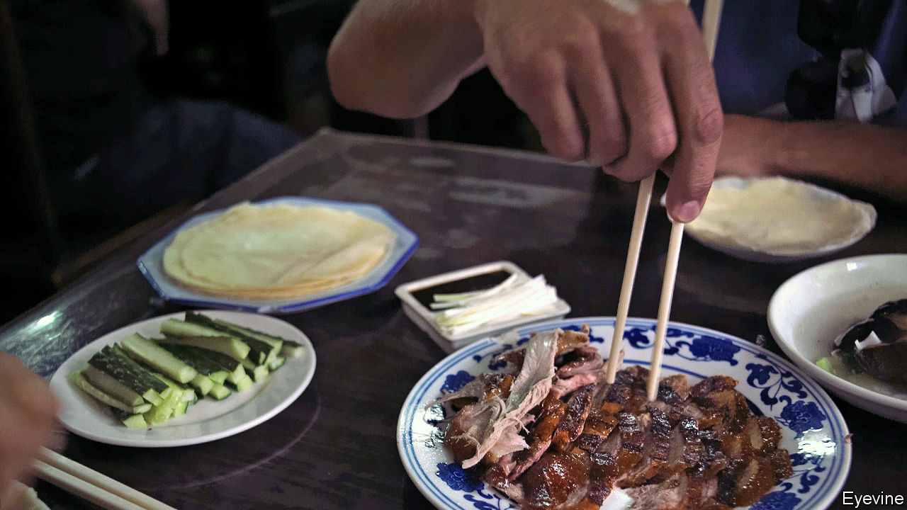

###### Revolution at the dinner party

# China asks: what’s the safest way to use chopsticks? 

##### Officials fret that people are sharing more than Peking duck 

 

> Apr 25th 2020 

Editor’s note: The Economist is making some of its most important coverage of the covid-19 pandemic freely available to readers of The Economist Today, our daily newsletter. To receive it, register . For our coronavirus tracker and more coverage, see our 

AT DINNER IN China, a courteous host uses her chopsticks to take the tastiest morsel from a communal dish and put it on the plate of an honoured guest. At a family meal, an elder does so for a child. Friends do it for each other. And all help themselves, taking bite-sized pieces again and again from plates of food in the middle of the table. So it has been for centuries. And then came covid-19.

In few other countries has the pandemic raised such painful questions about cherished cultural traditions as it has in China with respect to dining customs. Stories abound in Chinese media of people catching the coronavirus after sharing a meal. There is no proof that the chopsticks were to blame. People who share a meal tend to breathe on each other, too. But experts in China warn that transmission by chopstick is possible. As restaurants reopen, local governments are urging diners to adjust what Health Times, a newspaper controlled by the Communist Party’s mouthpiece, the People’s Daily, called their “bad dining habits”.


The aim of this “tongue-defence war”, as state media have dubbed the campaign, is to change the way chopsticks are used. Diners are encouraged to use designated communal ones for divvying up shared food. These extra chopsticks—often longer than usual and specially labelled or coloured—are not to be placed in the mouth. They are common in other chopstick-using societies, such as Japan and Taiwan, but swapping from one set of chopsticks to another is often considered a nuisance in mainland China. It is rarely done except in very formal settings.

In Hubei, the province worst affected by covid-19, schools are giving online lessons on how to be a good “communal-chopsticks pioneer”. A shopping mall in Shanghai is offering free parking to customers who agree to use them at its restaurants. Staff use red ink to stamp the bills of compliant customers, who redeem the perk on their way out. The city government in Beijing is drafting new rules on “civilised” behaviour. They require using separate chopsticks for serving (the penalty, if any, for violators has not been specified). State media are also promoting the Western practice of giving diners their own servings.

Concerns that infected saliva from a utensil can pass from one person to another via a shared dish are at least a century old, says Q. Edward Wang, author of “Chopsticks: A Cultural and Culinary History”. Among the first in China to campaign for dining-habit reform was a Malaysian-born doctor who saw hope in the “lazy Susan”—a rotating platform placed on a table so diners can spin the food to each other. He believed the device would reduce the spread of disease because each dish would have its own serving spoon. Lazy Susans eventually took off in China, but the spoons did not.

How different things might have been if people had paid attention to Hu Yaobang. In 1984 Mr Hu, then the Communist Party’s general secretary, suggested that, for the sake of hygiene, they “eat Chinese food the Western way” with knives and forks. “Peking has seen the future—and it lacks chopsticks”, was the headline in the New York Times. But Mr Hu’s idea was never likely to stick. Hardliners despised him as a Westernising liberal. Mr Hu’s death in 1989 sparked the Tiananmen Square upheaval, the crushing of which all but erased him from official history books, along with his radical idea. Recently state media have been drawing on antiquity to bolster their case. Eating separate portions, they claim, was the practice for 3,000 years until the Tang dynasty (618-907).

While calling for a “dining-table revolution”, state media are careful to respect the view of many Chinese that dish-sharing is a sign of intimacy. “Divide food, not love,” a common new slogan urges. In the capital, a Peking-duck restaurant offers serving chopsticks to any guest who asks for them. But a waitress says there are few requests. In a social-media poll of about 210,000 netizens, 27% said they would use serving utensils, but 30% said they would not, because it was “too much trouble”. ■

Dig deeper:For our latest coverage of the covid-19 pandemic, register for The Economist Today, our daily , or visit our 

